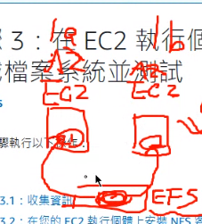
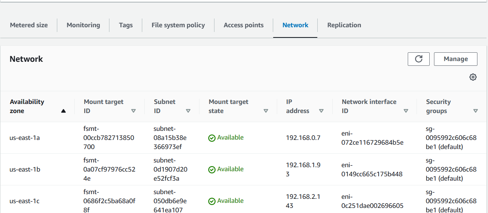
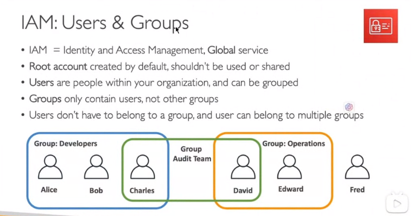
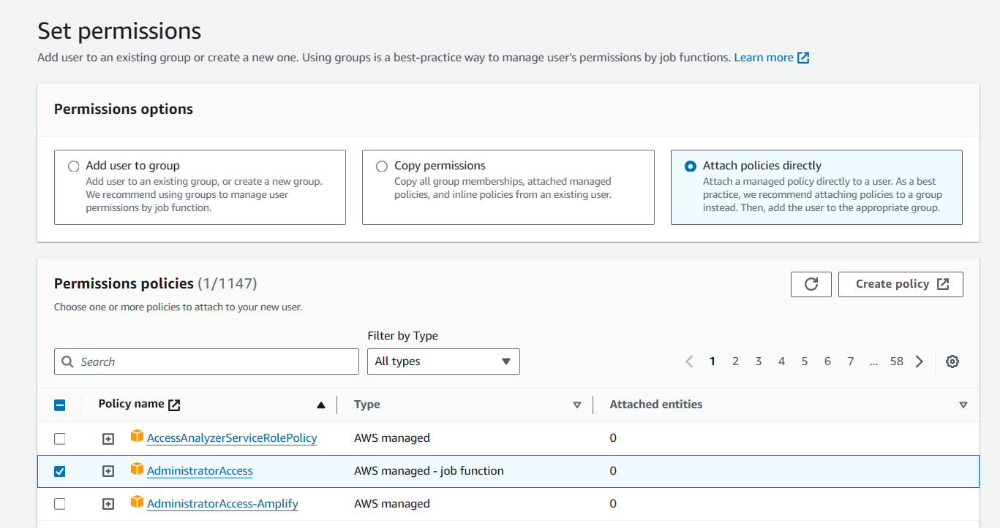

### Amazon EFS (Elastic File System)

Amazon EFS is a scalable, fully managed file storage service offered by AWS. In contrast to Amazon EBS, which provides block-level storage volumes, Amazon EFS presents a file system interface and supports concurrent mounting on multiple Amazon EC2 instances.

**Key Features:**

- **Multi-AZ Support:** Amazon EFS ensures high availability and fault tolerance by allowing the file system to be accessed from EC2 instances in different Availability Zones (AZ).

**Test Steps:**  [步驟 3：在 EC2 執行個體上掛載檔案系統並測試 - Amazon Elastic File System](https://docs.aws.amazon.com/zh_tw/efs/latest/ug/wt1-test.html)

1. **Enable VPC DNS Hostnames:**
   - Enable VPC DNS hostnames to facilitate resolution of public DNS hostnames to IP addresses for instances within the VPC.
2. **Create EFS:**
   - Create an EFS file system using the AWS Management Console or the command-line interface.
3. **Create Access Points:**
   - Establish access points to enable other EC2 instances to access the EFS file system.
4. **Modify EFS Network:**
   - Modify security groups to allow NFS access.
5. **Launch EC2 Instances:**
   - Launch two EC2 instances in different Availability Zones, demonstrating multi-AZ capability with security group port configuration for NFS.
6. **Install nfs-utils:**
   - Install the `nfs-utils` package if not already installed, using the command: `sudo yum -y install nfs-utils`.
7. **Mount EFS:**
   - After creating the directory (`mkdir efs`), mount the EFS using the command: `sudo mount -t nfs4 -o nfsvers=4.1,rsize=1048576,wsize=1048576,hard,timeo=600,retrans=2,noresvport fs-06caf6235bd4f557b.efs.us-east-1.amazonaws.com:/ efs`.
8. **Write to EFS:**
   - Navigate to the mounted directory (`cd efs`), set permissions (`sudo chmod go+rw .`), and write to a file (`echo "" > test.txt`).

### AWS Identity and Access Management (IAM)

IAM enables secure control over access to AWS services and resources, allowing management of users, groups, and permissions.

In a global service context, there is a unique username across the entire world, and this uniqueness extends to regions as well.

#### Policies inheritance

inline

### Test:

Create IAM User

### AWS Access

Accessing AWS can be done through various means, including the website, AWS CLI, and SDK.

**Access Methods:**

- **Website Access:**
  - Access AWS services through the official website.
- **AWS CLI:**
  - Utilize the AWS Command Line Interface for efficient interaction with AWS services.
- **SDK Access:**
  - Leverage Software Development Kits (SDKs) for programmatic access to AWS resources.

