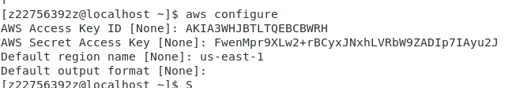
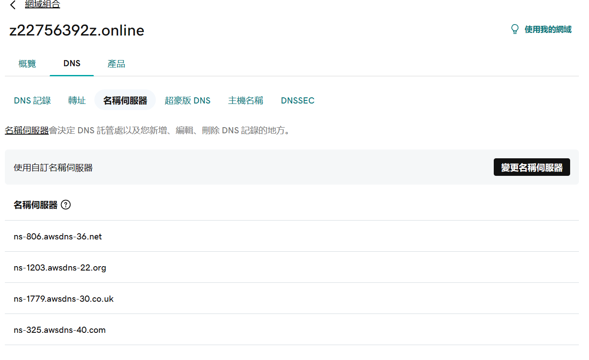

## Command Line Interface - CLI

[安裝或更新至 AWS CLI 的最新版本 - AWS Command Line Interface (amazon.com)](https://docs.aws.amazon.com/zh_tw/cli/latest/userguide/getting-started-install.html)


1. enable admin access permission for user

2. create asset key

   * [account](./CLI/User-Brian.md)

   * login: 

     

[Linux 使用 aws 指令上傳、下載、管理 S3 檔案教學與範例 - G. T. Wang (gtwang.org)](https://blog.gtwang.org/linux/linux-aws-command-upload-download-s3-file-tutorial-examples/#google_vignette)

`aws s3 cp file_name s3://bucket_name`: upload file

`aws s3 cp directory_name s3://bucket_name/desired_directory_name --recursive`:  upload directory to aws s3

`aws s3 mv file_name s3://bucket_name/file_name s3://bucket_name/new_file_name`: rename file

`aws s3 rm file_name s3://bucket_name/file_name`:  remove file

`aws s3 rm s3://bucket_name --recursive`: empty the bucket

`aws s3 rb s3://bucket_name`: remove bucket


## SDK

install python version above 3.7

install boto3 python package

```python
import boto3

s3 = boto3.resource("s3")

# 获得所有的 bucket, boto 会自动处理 API 的翻页等信息。
for bucket in s3.buckets.all():
    print(bucket.name)
```


## Route53

[網域組合：z22756392z.online (godaddy.com)](https://dcc.godaddy.com/control/portfolio/z22756392z.online/settings?tab=dns&itc=mya_vh_buildwebsite_domain)

get domain name

create new host zone in aws

modify domain server to match with aws host zones's



## Cross-Origin Resource Sharing (CORS)

When a resource on one domain (origin) is requested from another domain, it's considered a cross-origin request. CORS, or Cross-Origin Resource Sharing, is a security feature implemented by web browsers to control how web pages in one domain can request and interact with resources hosted on another domain.

resource can be image, text and so on.


first we create two bucket

one but upload index.html

````html
<html>
  <head>
    <title>My First Webpage</title>
  </head>
  <body>
    <h1>I love apple</h1>
	<p>Hello World</p>
  <body>
  
  
  <!-- CORS demo -->
  <div id="tofetch"/>
  <script>
    var tofetch = document.getElementById("tofetch");
	
	fetch('http://bucket-z22756392z-us-east-2.s3-website.us-east-2.amazonaws.com/extra.html')
	.then((response) => {
	  return response.text();
	})
	.then((html) => {
	  tofetch.innerHTML = html
	});
  </script>
</html>
````


and the second bucket we upload extra.html

```html
<p>This <strong>extra page</strong> has been successfully loaded!</p>
```


then modify the CORS permission for first bucket's index.html to fetch

``` 
[
 {
	 "AllowedHeaders": [
	   "Authorization"
	 ],
	 "AllowedMethods": [
	   "GET"
	 ],
	 "AllowedOrigins": [
	   "http://bucket-z22756392z-us-east-2.s3-website.us-east-1.amazonaws.com"
	 ],
	 "ExposeHeaders": [],
	 "MaxAgeSeconds": 3000
 }
]
```


[./CLI/User-Brian.md]: 
[.\CLI\User-Brian.md]: 
