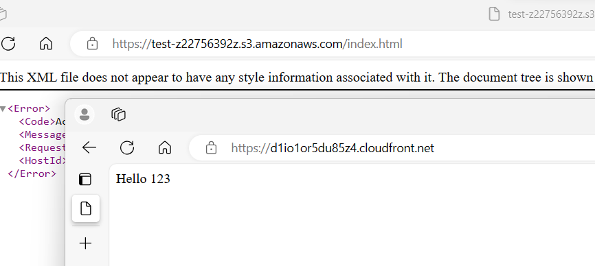
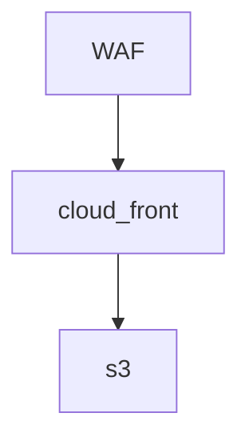
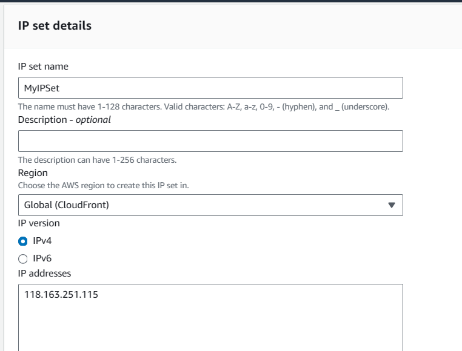
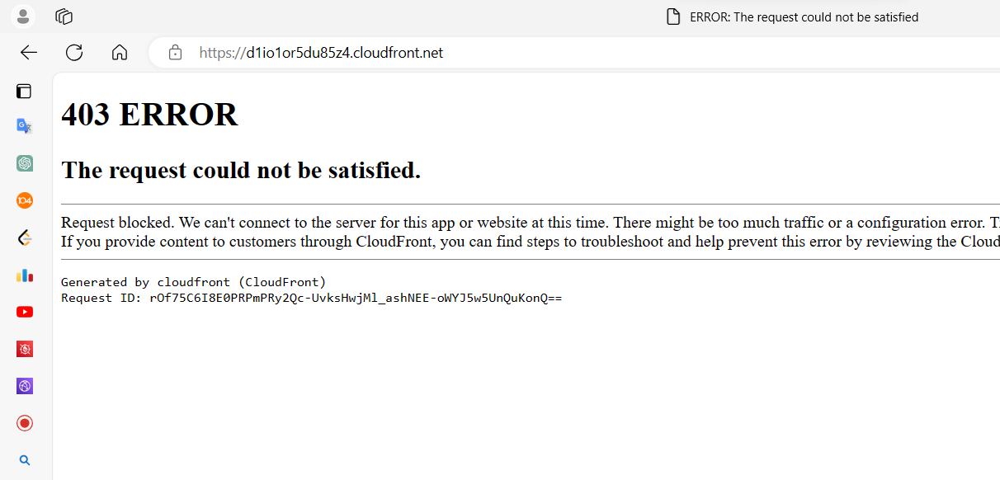
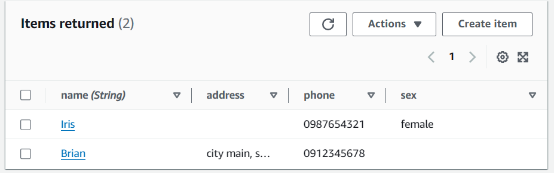

---

We would like to use CloudFront to connect to an S3 bucket for a website.

First, we create a new S3 bucket and block all access.

Next, we create a new CloudFront distribution and select the bucket we just created. In the settings, we choose **Origin Access Control Setting** and create a new access control setting. We modify the **Default Root Object** to be index.html. After creating the CloudFront distribution, we copy the policy provided and apply it to the S3 bucket policy we just created.


````
{
        "Version": "2008-10-17",
        "Id": "PolicyForCloudFrontPrivateContent",
        "Statement": [
            {
                "Sid": "AllowCloudFrontServicePrincipal",
                "Effect": "Allow",
                "Principal": {
                    "Service": "cloudfront.amazonaws.com"
                },
                "Action": "s3:GetObject",
                "Resource": "arn:aws:s3:::test-z22756392z/*",
                "Condition": {
                    "StringEquals": {
                      "AWS:SourceArn": "arn:aws:cloudfront::803647625959:distribution/EU9V24PLPS4QG"
                    }
                }
            }
        ]
      }
````

We then wait for CloudFront to finish deploying.




## WAF (Web Application Firewall)

To protect against DDoS and malicious attacks, we implement WAF.




we try out blocking a specific ip

 we create ip set (**ip_address/32**) ! remember to add /32!!



To test blocking a specific IP, we create an IP set (e.g., `ip_address/32`—remember to add /32). 

Then, we create an ACL:

- Toggle the CloudFront distribution.
- Add the CloudFront resource.
- Add rules (some may have associated prices).
  - Select "Add My Own Rule."
    - Rule Type: IP Set
    - Source IP Address
    - Action: Block




Close the ACL, deassociate, and delete the IP set.

Another rule involves rate limiting (e.g., 100 requests). We use a script to curl our CloudFront IP to reach the rate limit.


Another rule: Rule base rule

* rate limit: 100


use this script to curl our cloud front ip to reach the rate limit

```
for i in {1..110}
do
  echo $i
  result=`curl -o /dev/null -s -w %{http_code} https://d1io1or5du85z4.cloudfront.net/`
  if [[ "$result" == "200" ]] ; then
    echo "ok"
  else
    echo "fail"
  fi
done
```


---


mariadb, mysql, RDH --> relational database (strict, heavy)

NoSQL --> not relational database (quick)

 

DynamoDB

table name -- Address

partition key -- name

Then create items




login: [account](./CLI/User-Brian.md)

```
[root@localhost aws]# aws configure
AWS Access Key ID [None]: see above
AWS Secret Access Key [None]: see above
Default region name [None]: ap-northeast-2
Default output format [None]: 
```


```
import boto3
import os
os.environ['AWS_DEFAULT_REGION'] = 'ap-northeast-2'


_TableName_ = "Address"

client = boto3.client('dynamodb')

DB = boto3.resource('dynamodb')
table = DB.Table(_TableName_)

response = table.get_item(
    Key={
        'name': "Brian"
    }
)
response["Item"]

print(response['Item'])
```


## Lambda function

create role

name - Lambda rule

add - AmazonDynamoDBFullAccess, AWSLambdaBasicExecutionRole