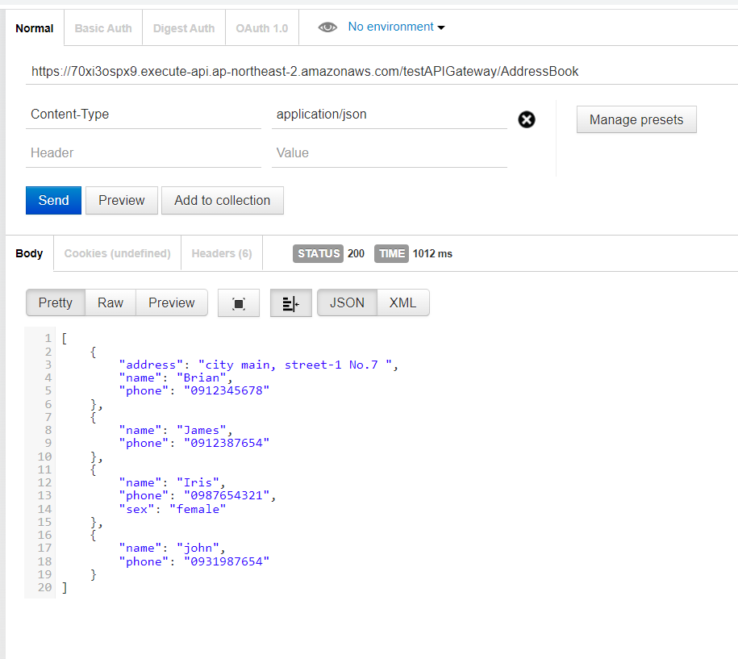

## Lambda Service Setup

Create a serverless service using AWS Lambda, capable of tasks such as archiving processes when a file is uploaded to S3 or embedding ChatGPT functionality.

* **Create IAM Role:**
  - Navigate to the AWS Management Console, go to IAM, and select "Roles."
  - Click "Create Role."
  - Choose "AWS Lambda" as the use case.
  - Name the role "Lambda rule."
  - Attach the following policies: AmazonDynamoDBFullAccess, AWSLambdaBasicExecutionRole, AWSLambdaSQSQueueExecutionRole, and AWSLambdaVPCAccessExecutionRole.
* **Create Lambda Function:**
  - Go to the Lambda service in the AWS Management Console.
  - Click "Create function."
  - Choose "Use a blueprint."
  - Name the function "test lambda."
  - Under "Execution role," select "Use an existing role" and pick the "Lambda rule" role we just created.

After lambda function created, we can manually configure event's value to trigger it or either use the similar method from others role's to trigger it.


Another Lambda function example: fetch dynamodb item, put.... and so on.

```python
import json
import boto3

client = boto3.client('dynamodb')

def lambda_handler(event, context):
  data = client.get_item(
    TableName='Address',
    Key={
        'name': {
          'S': 'Brian'
        }
    }
  )
  print(data['Item'])
  response = {
      'statusCode': 200,
      'body': json.dumps(data['Item']),
      'headers': {
        'Content-Type': 'application/json',
        'Access-Control-Allow-Origin': '*'
      },
  }
  return response
```


API Gateway
Assuming we have a GUI with buttons for listing, updating, and deleting items, through the help of API Gateway, we can pass events to Lambda and implement the mentioned functionalities in the GUI.

For a follow-up on RESTful API, create a Lambda function with the following Python code:

```python
import json
import boto3
import logging

logger = logging.getLogger()
logger.setLevel(logging.INFO)

dynamodb = boto3.resource('dynamodb',region_name='ap-northeast-2')

def lambda_handler(event, context):
  print(event)
  data = {
    'Items' : "Bad Request"
  }
  statusCode = 200
  path = event["path"]
  httpMethod = event["httpMethod"]
  table = dynamodb.Table('Address')
  if httpMethod == 'GET' and path == '/AdressBook':
    data = table.scan()
  elif httpMethod == 'POST' and path == '/AdressBook':
    if event['body'] is not None :
      body = json.loads(event['body'])

      table.put_item(
        Item={
          'name': body['name'],
          'phone': body['phone']
        },
      )

      data = {
        'Items' : "addrbook created statusCodeuccessfully"
      }
    else:
      data = {
        'Items' : "Invalid Payload"
      }
      statusCode = 400
  else:
    statusCode = 400

  print(data['Items'])
  response = {
    'statusCode': statusCode,
    'body': json.dumps(data['Items']),
    'headers': {
       'Content-Type': 'application/json',
    },
  }

  return response
```


Connecting to API Gateway

1. Select REST API.

2. Create a new API named "TestAPI."

3. Set API endpoint type to "Regional."

4. Create the API.

5. Create a resource with path / and name it "AddressBook."

6. Create a method with type "GET."

7. Set integration type to Lambda function and enable Lambda proxy integration.

8. Choose the Lambda function created earlier.

   

Now, you can call the Lambda function through the API Gateway using the test button.

#### Deploy API
Deploy the API with a new stage and deploy it.

In Google, select the extension functionality "Tabbed Postman," copy the deployed URL, and use the defined path in API Gateway to invoke a specific function.



## Infrastructure with Terraform

[Install | Terraform | HashiCorp Developer](https://developer.hashicorp.com/terraform/install?product_intent=terraform)

infrastructure as whole 

we are going to manipulate aws through the terraform


Create a Terraform file (e.g., `main.tf`) with the following content:

```
variable "region" {
    type = string
    default = "us-east-1" # the region we would like to create in
    description="aws region" 
}

variable "amis" {
    type=map
    default = {
        us-east-1 = "ami-079db87dc4c10ac91" // ec2 ami type (this is free tier)
    }
    description = "ami id"

}

variable "instance_type" {
    type=string
    default = "t2.micro"
    description = "EC2 instance type"
}
```

```
provider "aws" {
  region = var.region
}

resource "aws_instance" "mytest_vm" {
  ami = lookup(var.amis, var.region)
  instance_type=var.instance_type
  
  tags = {
   # Name = "mytest",
 }
}
```


Run the following commands:

* `terraform init`: Initialize.
* `terraform plan`: Check syntax and predict results.
* `terraform apply`: Apply changes.
* `terraform destroy`: delete the instances.


```
provider "aws" {
  region = var.region
}
//       type     , name
resource "aws_vpc" "testvpc1"{
    cidr_block="192.168.0.0/16"
    tags = {
        Name = "testvpc1"
    }
}

resource "aws_subnet" "testvpc-web" {
//Retrieve the TestVPC1 ID associated with this subnet to use it in the creation process.
    vpc_id = "${aws_vpc.testvpc1.id}"
    cidr_block = "192.168.1.0/24"
    tags = {
        Name = "testvpc-web"
    }
}
```

