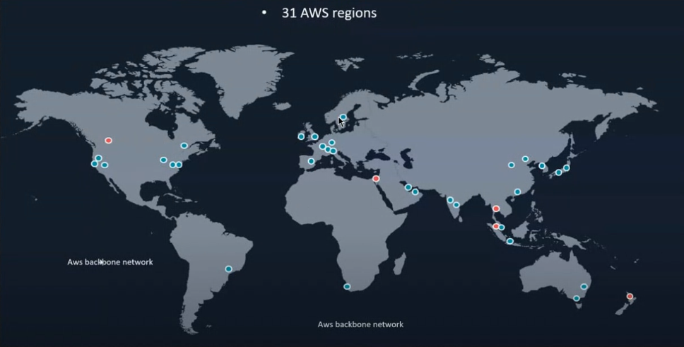
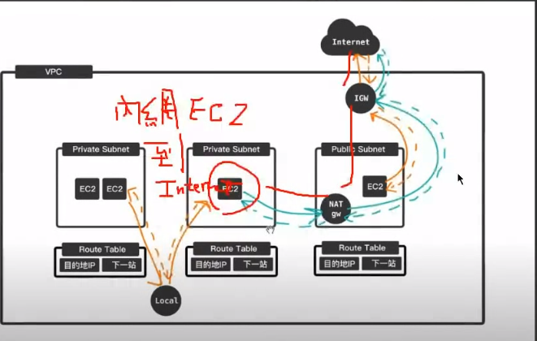
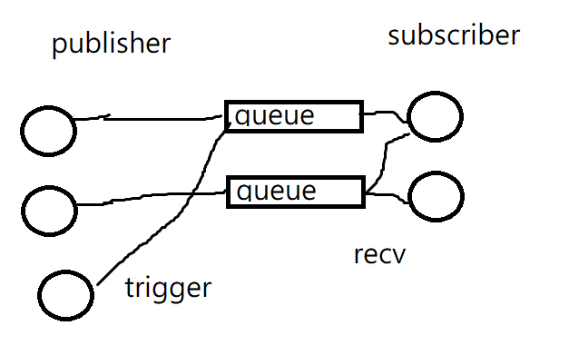
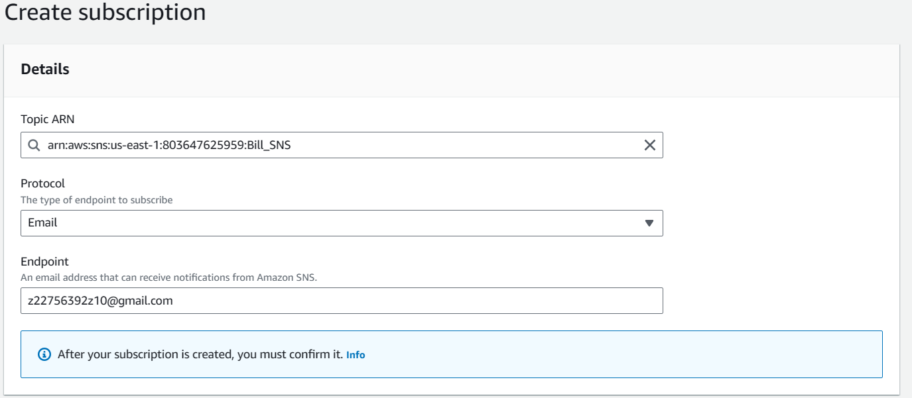
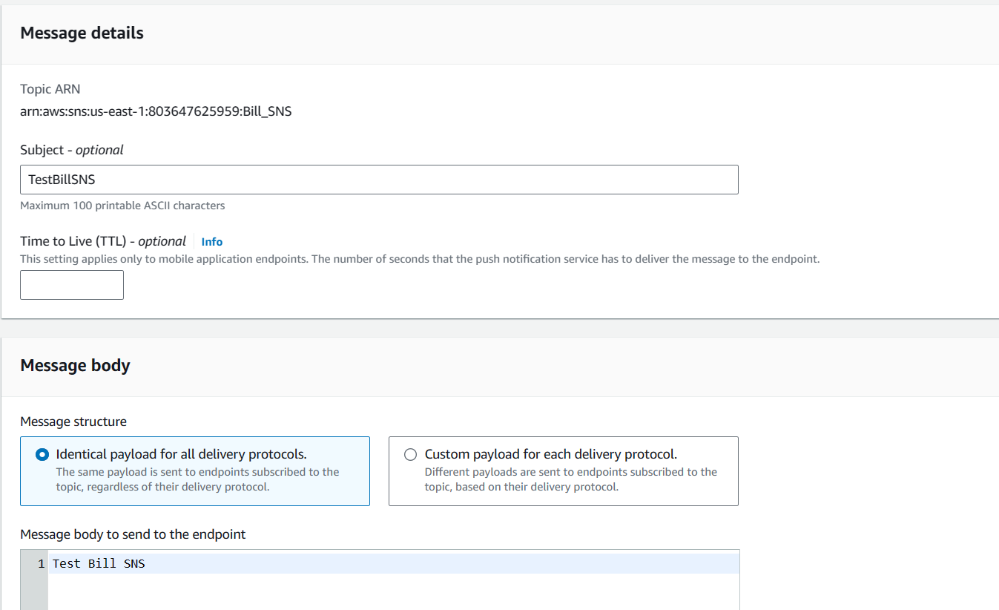
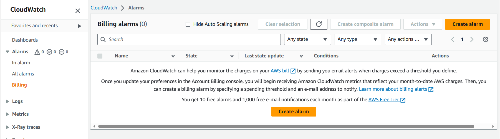
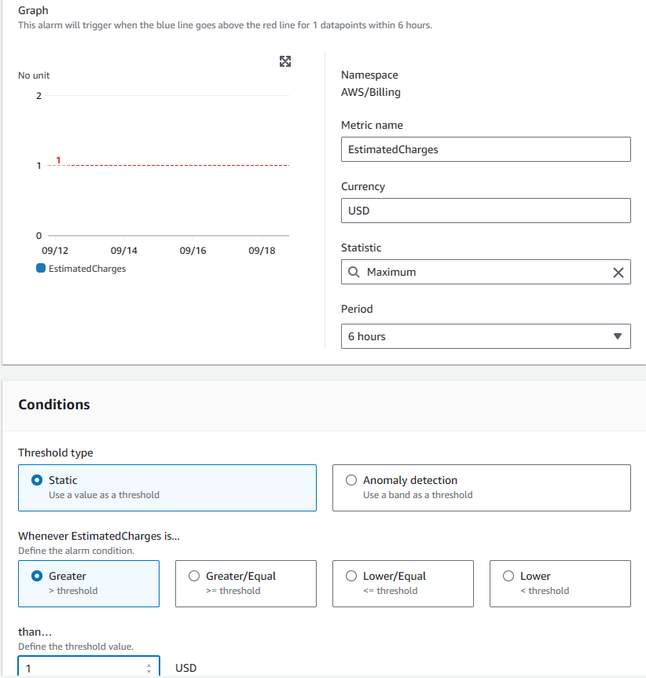
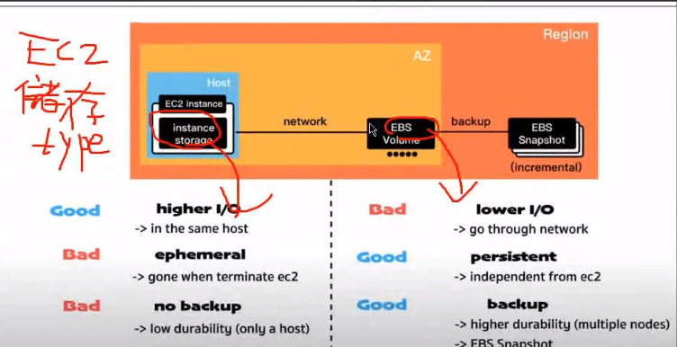
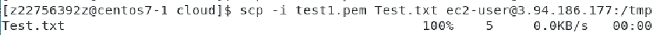

cloud => calculating , storage and network

## Regional Considerations

When working with AWS services, it's crucial to select the appropriate AWS region. It's worth noting that different regions can have variations in the services they offer and their pricing structures.

For example in ec2 and vpc is region specific, and IAM and s3 is global

>IAM(identity and aces management), s3(storage) 
>
>if top-right region selection is global that mean you can use this servce regardless of region.

### Availability Zones 

Availability Zones are smaller data center facilities within an AWS region that provide redundancy and stability. Each AWS region may comprise a different number of Availability Zones, with some regions having multiple Zones.

Availability Zones can be associated with different subnets within a region. You can manage these associations in your Virtual Private Cloud (VPC) configuration.

## VPC

virtual private cloud

### Internet Gateway (IGW)

An Internet Gateway (IGW) serves as a bridge between a private cloud (within your VPC) and the external internet.

In the default VPC, subnets are automatically connected to the IGW, so you don't need to concern yourself with network connectivity.

However, in a custom VPC, you'll need to manually configure the connections, including subnets and IGW, to establish connectivity with the external network.

## NAT gw

nat gateway

let the virtual machine inside private cloud to access outter internet, which may because the virutal machine may need to download something in outer net.

and it only allow virtula machine to access outer net. However out net couldn't access the virutal machine inside the private cloud.

## How Ec2 commuately with each other

They use router inside the vpc

### Security

#### Network Access Control Lists (NACLs)

Are a security feature in Amazon Web Services (AWS) that provide an additional layer of security for your Virtual Private Cloud (VPC) subnets. NACLs act as stateless network traffic filters at the subnet level, controlling both inbound and outbound traffic based on specified rules.

NACLs are **non-conditional**, meaning they apply their rules indiscriminately to both inbound and outbound traffic.

#### Security Groups

Security Groups are used to control the inbound and outbound traffic for Amazon Elastic Compute Cloud (EC2) instances or virtual machines. They act as virtual firewalls around your instances, allowing you to define rules for traffic access.

Security Groups operate **conditionally**, meaning they may inspect incoming traffic, but they do not examine outgoing traffic.

#### ENI

they provide the access of outernet. ENI can connect with two respectly ec2

For example, one ec2 provide mysql database, if the one ec2 is shotdown the service may stop. Howerver if there are another ec2, we can use the second ec2 to provide the service. To outside they only need to connect to ENI they don't need to know which ec2 provide service.

## Amazon SNS (Simple Notification Service)

Amazon SNS, which stands for Simple Notification Service, is a versatile service provided by AWS. It operates on a publish and subscribe system, making it efficient for sending messages to multiple subscribers or endpoints.

## Billing Alerts with Amazon SNS

You can configure Amazon SNS to send notifications when your billing exceeds a specified amount. This feature allows you to stay informed about your AWS usage and expenses.

To set up billing alerts using Amazon SNS:

* Create a topic using the standard mode.
* Once the topic is created successfully, you'll need to configure subscribers to receive notifications.

​		

* Publishers can then emit messages to the subscribers, triggering notifications.

Now that you've successfully set up Amazon SNS for billing alerts, the next step is to implement service monitoring, especially for metrics like billing usage.

## Amazon CloudWatch

Amazon CloudWatch is a powerful AWS service used for monitoring various aspects of your AWS resources and applications. It allows you to collect and track metrics, collect and monitor log files, and set alarms.

### Creating Alarms

Then, select the SNS we jsut create.

We can create alarms in Amazon CloudWatch to monitor specific metrics. When thresholds are breached, CloudWatch can trigger actions, such as sending notifications via Amazon SNS. This combination of CloudWatch and SNS provides a flexible way to monitor various metrics and receive timely notifications.

## EC2

#### Instance storage

fast read and write operation

ephemeral -- if the machine is terimaled all the storage will lost as well as the machine broken.

#### EBS volume

elastic block store

internet storage device

persisent --  if the machine is terimated the data will not lose. It also has snapshot backup.

### Lanch instance

name config

choose AMI(Amazon machine image)

choose instance type -- hardware  

* Family: t1, r1 -- memory oriented, c1 -- CPU oriented, m1 --memory oriented

* scale: nano, micro, small, medium, large, xlarge...

choose key pair --  if we have this key pair we can no-password login 

config network settings

config storage

config number of instance

## Upload data to cloud through vm

launch vm

upload AWS's key.pem to vm

chmod 400 (readonly for owner)

ssh -i key.pem ec2-user@myAWS_IP: `-i` use following key

upload txt file to cloud

scp -i key.pem test.txt ec2-user@myAWS_I:/to_desire_cloud_directory

