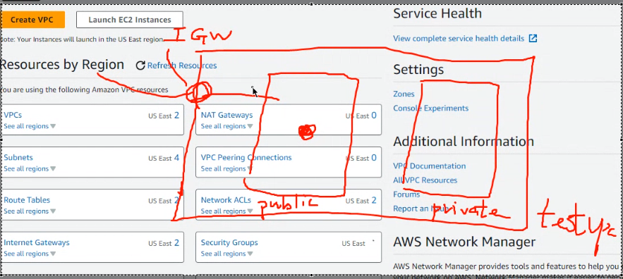

[Region consideration](./Region_consideration.md)

## ELB - Elastic Load Balancer

ELB stands for Elastic Load Balancer, a service that ensures more responsive and fault-tolerant application delivery by distributing incoming traffic across multiple Amazon EC2 instances.


#### ASG - Auto Scaling Group

ASG represents Auto Scaling Group, which allows EC2 instances within an ELB to automatically adjust in response to changing traffic loads. It can also scale based on predefined metrics. For example, when a service's utilization reaches 90%, you can configure it to automatically scale EC2 instances.


## Setting up


#### Creating VPC

To create a VPC, follow these steps in the AWS Virtual Center:

1. Create two EC2 instances: one for web and one for the database.
2. Set up a NAT Gateway (NAT-GW) for external network access.
3. Create an Internet Gateway (IGW).


* Creating VPC


* Config VPC


* Create subnet

  When selecting subnets, you can choose different subnets for safety reasons. For example, in the US East region, you have six subnets available. In your case, we can chose the first subnet and second subnet.


> Please note that initially, these subnets are private networks. To make them public, you need to attach an IGW to the VPC and connect the subnet through a routing table.

* Create IGW

  Create an IGW to make the subnet public.
  

* attach IGW to VPC


However, even after attaching the IGW to the VPC, you still need to configure routes to establish a path.


* Configuring VPC's Routing Table

  Edit the routes and add a route with the destination set to "anywhere" (0.0.0.0/0) and the target as the IGW.

  

  * edit subnet association

    Lastly, associate the public subnet with the IGW.


By following these steps, you'll have a fully configured VPC with public and private subnets and the necessary routing to ensure connectivity.


#### EC2 setup

1. **Instance Type Selection**

   When setting up your EC2 instance, select the instance type "Amazon Linux" with the "t2.micro" configuration.

    

2. **User Data Configuration**

   User data allows you to run commands automatically when the EC2 instance starts. You can use the following script to update packages, install the Apache web server, start it, and create a basic HTML page.

   ```
   #!/bin/bash
   yum update -y
   yum install -y httpd.x86_64
   systemctl start httpd.service
   systemctl enable httpd.service
   echo "Hello World from \$(hostname -f)" > /var/www/html/index.html
   ```

   Paste this script into the user data field as shown below:


After launching the EC2 instance with these configurations, you'll have a basic web server up and running. However, please note that you can currently only access your website using HTTP, as HTTPS has not been configured yet.

To access your website, use a web browser and enter the public IP address or public DNS name of your EC2 instance. You'll see a "Hello World" message as shown in the screenshot:


Keep in mind that for secure access (HTTPS), you will need to set up SSL/TLS certificates and configure your web server accordingly.


#### result




## Command

`sudo bash -c 'echo "hi" > hi.htm'`

`scp -i ./key.pem web.htm ec2-user@my_ip:/tmp`: upload file to ec2 through ssh

`scp -i ./key.pem -r directory ec2-user@my_ip:/tmp`: upload directory to ec2 through ssh