**Billing:** Amazon will send payment at the end of every month.

> Enabling auto-assign public IPv4 address in subnet, allow instances in that subnet to access the internet.

**Setting up:**

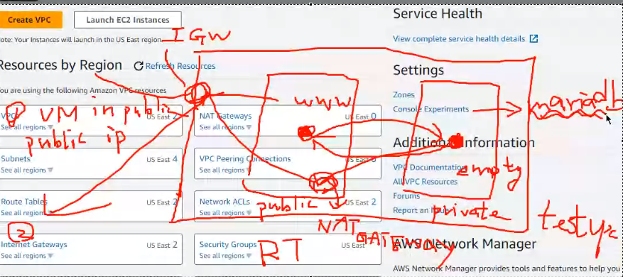

1. **Setting Up Subnet and Enabling Internet Access:**

   - Create a new EC2 instance for the database in a private subnet within the `test_vpc`.
   - Configure a new security group allowing SSH and MySQL access.
   - Enable auto-assign public IPv4 address in the subnet, allowing instances in that subnet to access the internet.
   - 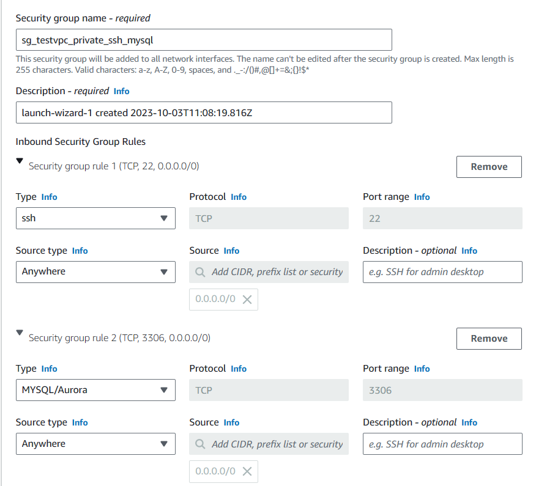

2. **Connecting Public and Private EC2 Instances:**

   - Upload the private EC2 key to the public EC2 instance so you can access the private EC2 through the public one.

   - Use the following commands:

     ```
     scp -i ./key.pem key.pem ec2-user@public_ip_address:/home/ec2-user
     ssh -i ./key.pem ec2-user@private_ip_address
     ```

   - 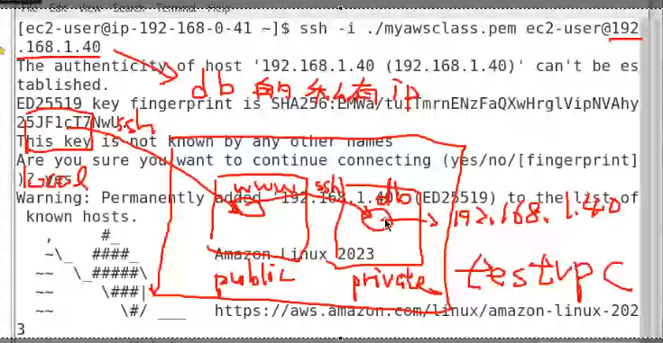

     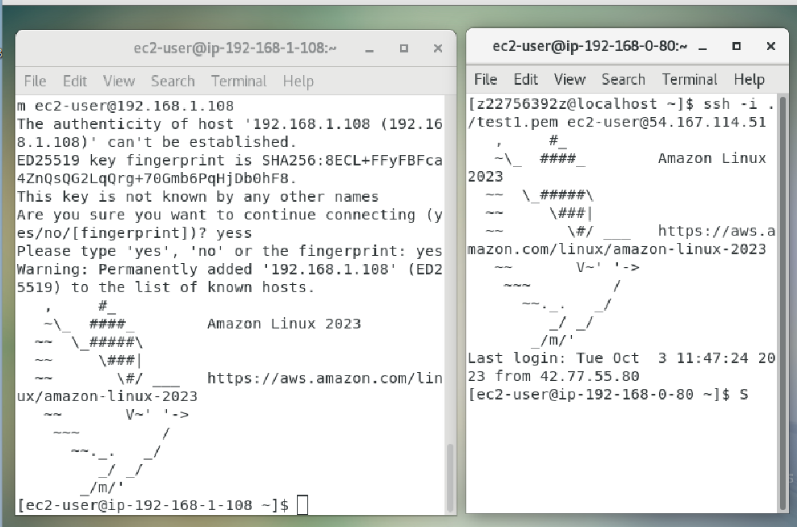

3. **Checking Routing and Enabling Internet Access:**

   - Check the routing for the database using `ip route show` and `route -n` commands to examine the route table.
   - Utilize a NAT Gateway to allow the private EC2 instance to pass packets to the public EC2, enabling internet access.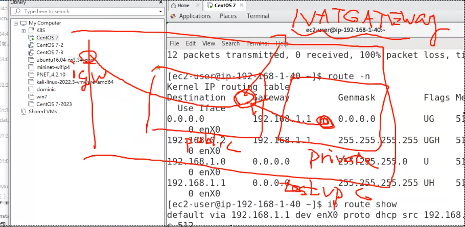
   - Create a new NAT Gateway in the VPC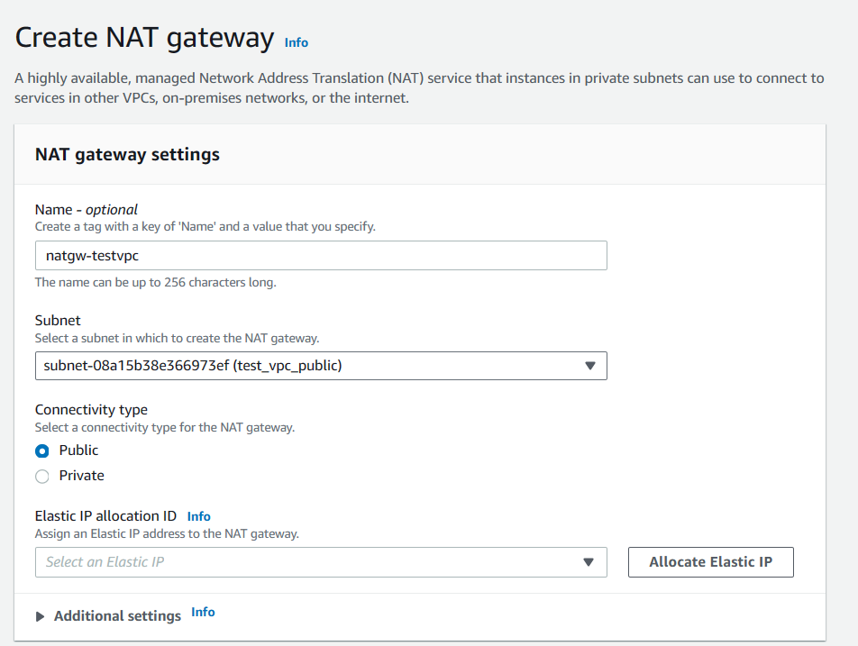 ,allocate an Elastic IP, and configure the route table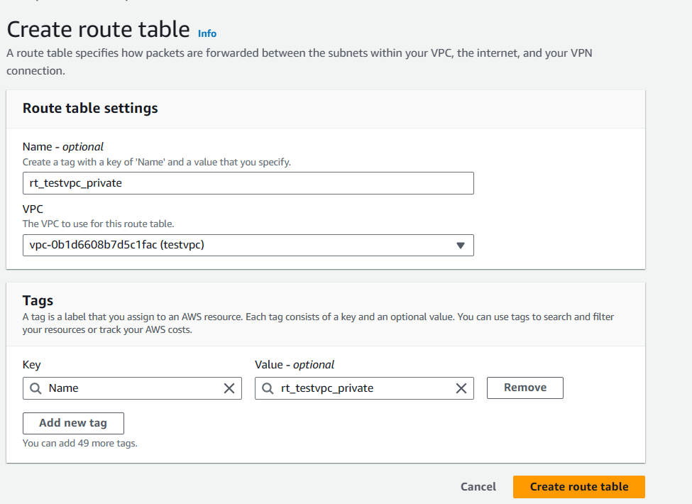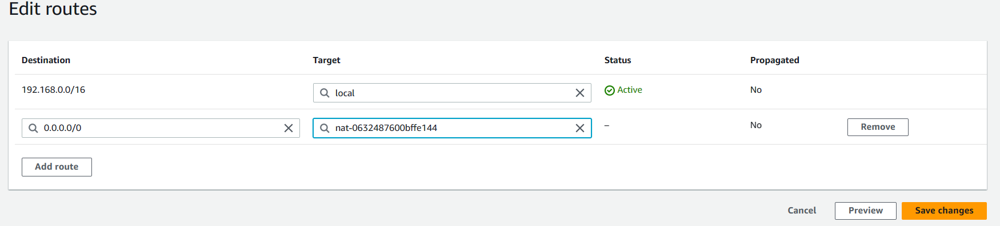 for the private subnet to direct traffic through the NAT Gateway.

4. **Installing MariaDB on the Private EC2:**

   - Follow the provided steps at [this link](https://linux.how2shout.com/installing-mariadb-on-amazon-linux-2023/) to install MariaDB on the private EC2 instance.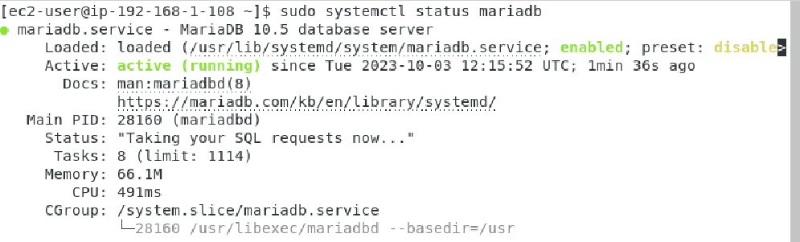

   - Secure the MariaDB installation by running `sudo mysql_secure_installation`.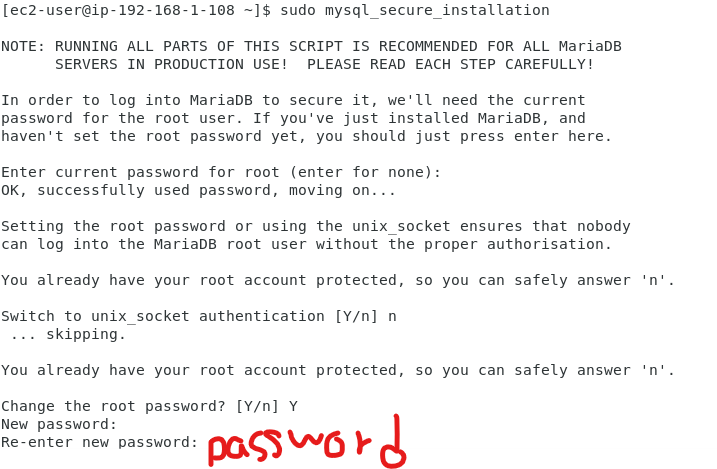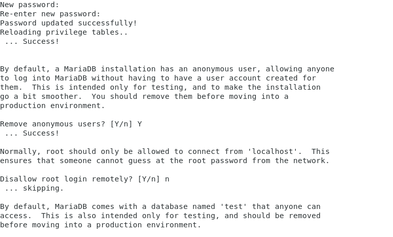

   - Create a user account that the public EC2 (web server) can use to access the database:

     > CREATE USER user@'%' IDENTIFIED BY 'user'; : create new user account is "user" and password is "user"

     ```
     CREATE USER user@'%' IDENTIFIED BY 'user';
     GRANT ALL PRIVILEGES ON * . * TO 'user'@'%';
     FLUSH PRIVILEGES;
     ```

   - Connect to the database using:

     > mysql -u user -p  -h database_ip_address: connect to database (`-u`: mean username, `-p`: mean password, `-h`: ip address)

     ```
     mysql -u user -p -h database_ip_address 
     ```
