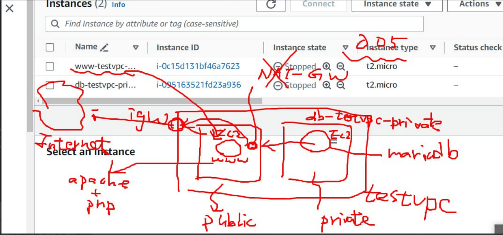
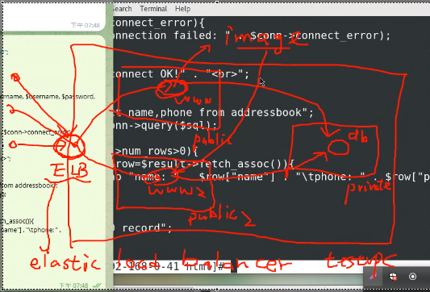
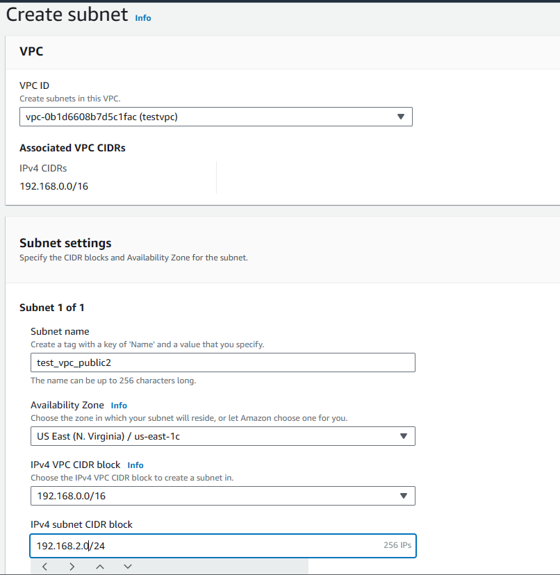

## Setup Preview



In our VPC, we've established two EC2 instances, each with distinct roles and connectivity:

1. **Public EC2 Instance (Web Server):**
   - This EC2 instance boasts a public IP address.
   - It serves as the public-facing web server, hosting the website.
   - It has the capability to access the internet through an Internet Gateway (IGW), facilitating interaction with external resources.
2. **Private EC2 Instance (Database Server):**
   - The private EC2 instance specializes in managing the database.
   - It lacks a public IP address and remains isolated from direct internet access.
   - For security purposes, we've implemented a method to access the private EC2 instance from the public one using SSH, ensuring controlled and protected database access.


## Setting up

**MySQL Syntax:**

```
show databases;
create database database_name;
use database_name;
create table table_name(record_name varchar(50) not null, record_name ...);
insert into table_name(record_name, ...) value(record_value, ...);
update addressbook set record_name=record_value where record_name=record_value
```

**Database Setup:**

```
create database m_data;
use m_data;
create table address_book(name varchar(50) not null, phone char(10));
insert into address_book(name, phone) value("Brian", "1234567890");
insert into address_book(name, phone) value("Iris", "2468135790");
insert into address_book(name, phone) value("James", "1357924680");
select * from address_book;
```

```
+-------+------------+
| name  | phone      |
+-------+------------+
| Brian | 1234567890 |
| Iris  | 2468135790 |
| James | 1357924680 |
+-------+------------+
```


**Apache and PHP Setup:**

```
sudo yum install php8.1 php8.1-fpm.x86_64 php8.1-mysqlnd.x86_64 -y
cd /var/www/html
sudo passwd root
password
vim test.php
```

In the `test.php` file, add the following content:

```
<?php phpinfo() ?>
```


```
systemctl restart httpd.service
```


**Apache and Php Connect Database**

**Check for connection (test.php):**

```
<?php
$servername = "192.168.1.108";
$username = "user";
$password = "user";

// Create connection
$conn = new mysqli($servername, $username, $password);

// Check connection
if ($conn->connect_error) {
  die("Connection failed: " . $conn->connect_error);
}
echo "Connected successfully";
?>
```

**List Database content**

```php
<?php
$servername="192.168.1.108";
$username="user";    
$password="user";
$dbname="m_data";

$conn = new mysqli($servername, $username, $password, $dbname);

if($conn->connect_error){
    echo "connect failed!" . "<br>";
    die("connection failed: " . $conn->connect_error);
}
else{
    echo "connect OK!" . "<br>";
}

$sql="select name,phone from address_book";
$result=$conn->query($sql);

if($result->num_rows>0){
    while($row=$result->fetch_assoc()){
        echo "name: " . $row["name"] . "\tphone: " . $row["phone"] . "<br>";
    }
} else {
    echo "0 record";
}
?>
```


**Load Balance**



To enhance the reliability of website, we can implement load balancing:


1. Create a new subnet, "test_vpc_public2," and enable auto-assign IP addresses.

   

2. Edit the route table to associate it with "test_vpc_public2."

   

3. create public1_ec2 ami using **Image and templates** 's **Create image** for future use.

[week7](./AWS_week7)