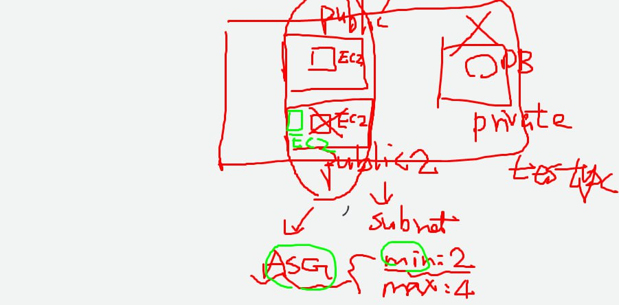
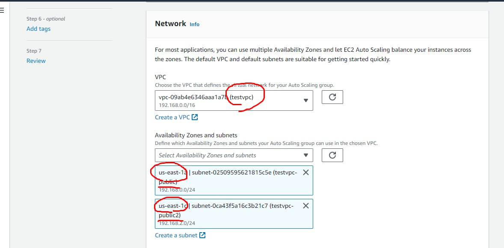
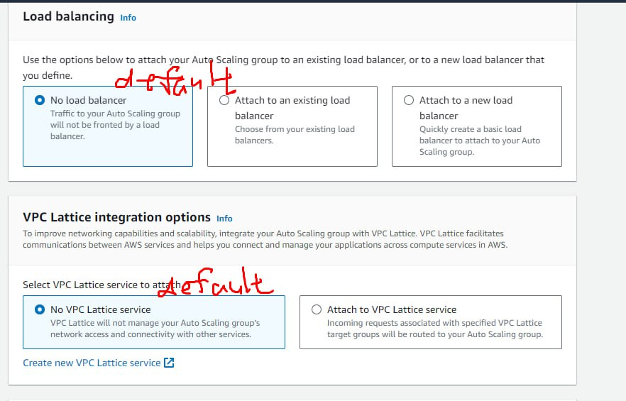
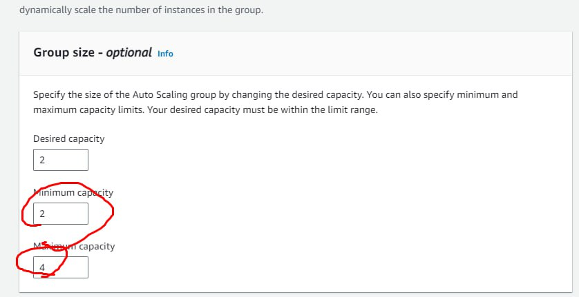
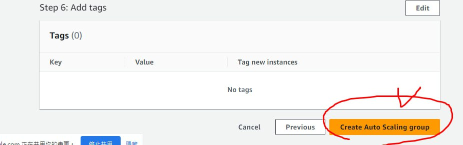
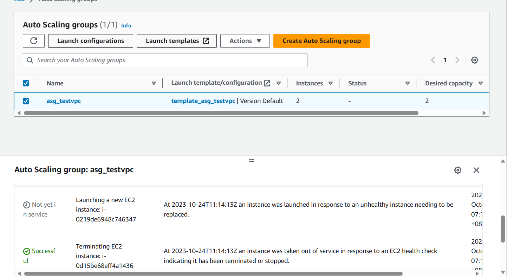
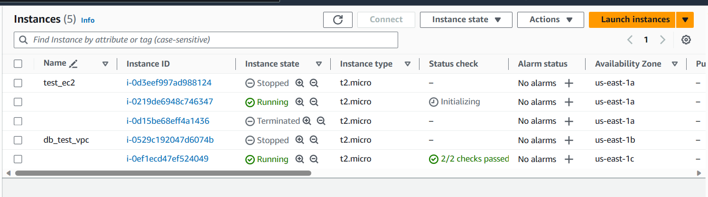
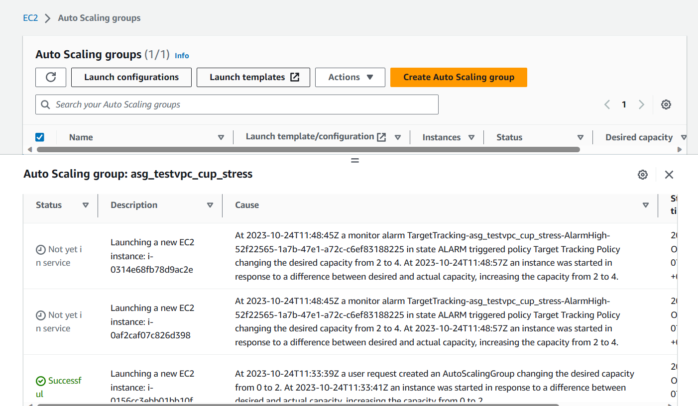
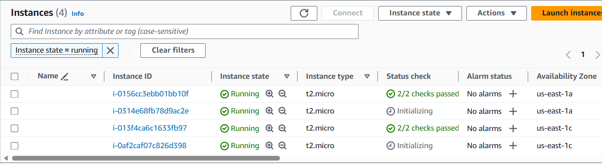
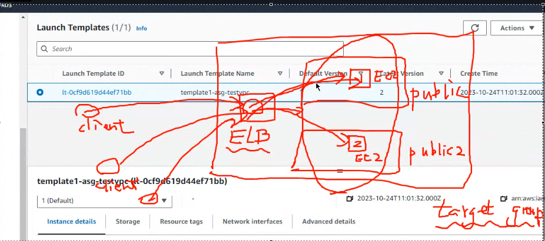

## Auto Scaling Group (ASG)

helps manage and adapt to changes in system loads, such as the increased traffic experienced during specific events or festivals. ASG can automatically address these fluctuations by employing two primary scaling strategies: vertical scaling and horizontal scaling.

* **Vertical Scaling:** Vertical scaling involves enhancing the hardware capabilities of an individual machine to accommodate increased demands. This process typically includes upgrading components like CPU, memory, or storage to make a single machine more robust. Vertical scaling is beneficial when applications require more power on a single machine.
* **Horizontal Scaling:** Horizontal scaling revolves around increasing the number of machines or instances to distribute the increased load


ASG works through the following process:

1. **Monitoring:** ASG continuously monitors the health and performance of instances and the system as a whole.
2. **Scaling Trigger:** When monitoring metrics indicate a need for scaling (e.g., high CPU usage due to increased festival traffic), ASG triggers the scaling process.
3. **Scaling Policies:** ASG follows predefined scaling policies, which dictate whether to perform vertical or horizontal scaling. These policies define the specific criteria for adding or removing instances or modifying hardware.
4. **Scaling Action:** Based on the scaling policies, ASG carries out the necessary action. For vertical scaling, it may upgrade the hardware of a machine, while for horizontal scaling, it can launch new instances or terminate existing ones.
5. **Load Balancing:** When employing horizontal scaling, load balancers are often used to distribute incoming traffic evenly among the instances.
6. **Ongoing Optimization:** ASG continually assesses instance health and performance. If instances become unhealthy or underutilized, ASG can replace them with new instances to maintain optimal system operation.


## Setting Up

We will utilize Auto Scaling Groups (ASG) to automatically initiate EC2 instances, ensuring that we always meet the minimum number required.



* **Create an Auto Scaling Group (ASG):**

  - ASG Name: asg_testvpc

  - **Create a Launch Template:**

    - Template Name: template_asg_testvpc
    - User Data:

    ```
    #!/bin/bash
    yum update -y
    yum install -y httpd.x86_64
    systemctl start httpd.service
    systemctl enable httpd.service
    echo “Hello World from $(hostname -f)” > /var/www/html/index.html
    ```

    

  - **Result**:

    


Now we would also utilize Auto Scaling Groups (ASG) to automatically initiate EC2 instances, ensuring that we meet monitored metrics (: cpu stress.) 

* **Create an Auto Scaling Group (ASG):**

  * ASG Name: asg_testvpc_cpu_stress
  * select previous template
  * same network setting
  * health checks
    * grace period: the first check time of health check in case 
  * scaling policies: enable metric -> Average CPU utilization

* experiment

  * connect to EC2 through ssh

  * install stress package: `sudo yum install stress`

  * increase CPU stress: `sudo stress --cpu 4`

  * view metrics through EC2 or ASG's Monitoring

  * result:

    ​	


Now, we will implement an Elastic Load Balancer (ELB). The ELB will efficiently route client requests to a target group that includes our EC2 instances. This setup ensures a reliable and balanced distribution of traffic among our resources.



* Create target group
  * target type: instances
  * name: tg_testvpc
  * Protocol: 80
  * VPC: testvpc
* Create Load Balancer
  * type: ALB
  * name: alb_testvpc
  * internet facing
  * network: 
    * IPv4
    * testvpc
    * subnet 1a, 1c
  * target group: tg_testvpc