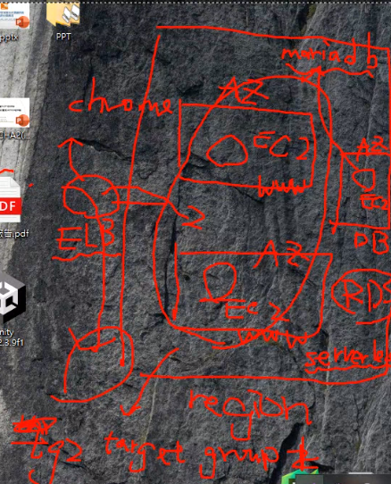
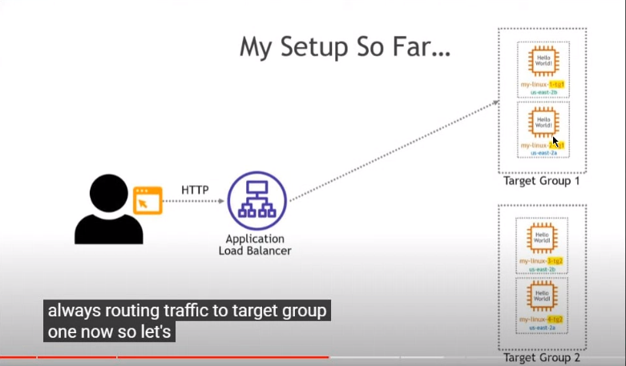
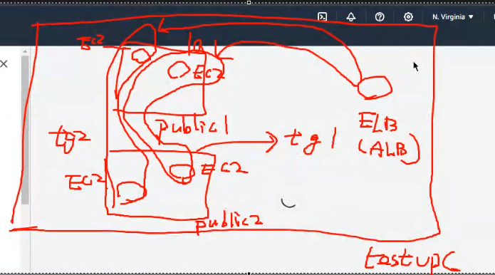
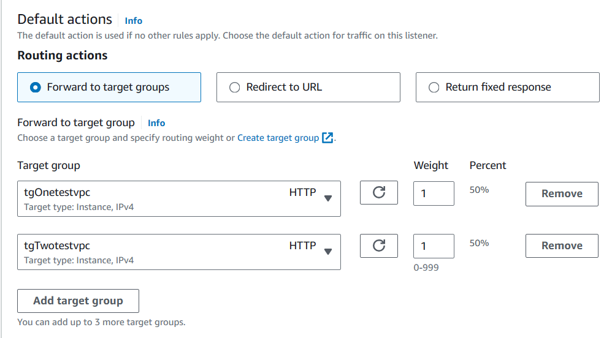
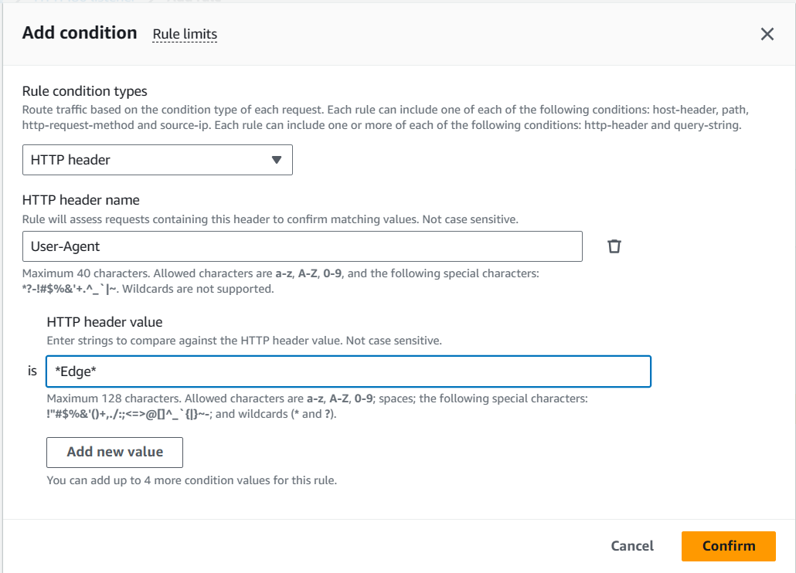
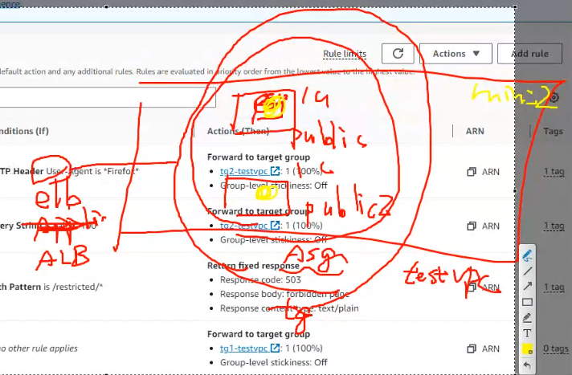
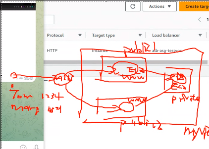

## Overview

**Setting Up ELB and Utilizing Multiple Target Groups**

This allows us to route users to different target groups based on their browser type or URL configurations. Such a setup not only offers a high degree of customization but also enhances overall efficiency.

**Transition to Serverless Architecture**

In the past, the conventional method involved manual configuration when dealing with servers. However, with the introduction of serverless services like the Relational Database Service (RDS), as a serverless solution, is activated automatically, eliminating the need for manual setup as previously required.



---

**Future overview**

As we look ahead to future setups, there are two key components to consider:

**Elastic Cache**: This component serves the purpose of edge computing, significantly improving response times. By providing caches closer to the user on the edge, it effectively reduces the server's workload, resulting in more responsive services.

**CloudFront**: It's important to note the distinction between using HTTPS in the "outernet" and HTTP in AWS. CloudFront is a content delivery service that plays a vital role in optimizing content delivery to users.


---


## Setting up

**Initial Target Group Configuration**

In the initial stage, we will configure two target groups for ELB. This configuration can be used to split traffic evenly, with 50% allocated to each target group. In practical terms, this means each EC2 instance will receive 25% of the total traffic.

Alternatively, we can utilize HTTP headers to determine the appropriate target group for routing, bypassing the need for strict traffic percentage allocations.




**Creating EC2 Instances and User Data Configuration**

Next, we will create two EC2 instances in the public subnet 1, referred to as A and B, and two EC2 instances in the public subnet 2, named C and D.

We will group A and C into target group one, and B and D into target group two.

Here is the user data script for our EC2 instances:

```
#!/bin/bash

########################################
##### USE THIS WITH AMAZON LINUX 2 #####
########################################

# Obtain administrative privileges
sudo su

# Install httpd (Amazon Linux 2 version)
yum update -y
yum install -y httpd.x86_64
systemctl start httpd.service
systemctl enable httpd.service
echo "Hello World from $(hostname -f)" > /var/www/html/index.html
```




**Configuring ELB with Multiple Target Groups and Listener Rules**

After creating target groups, the next step is to associate them with your Elastic Load Balancer (ELB). Here's how you can configure ELB listener rules to route incoming requests to the appropriate target groups:

1. **Configuring ELB with Multiple Target Groups and Listener Rules**

After creating target groups, the next step is to associate them with your Elastic Load Balancer (ELB). Here's how you can configure ELB listener rules to route incoming requests to the appropriate target groups:

2. **Configure Listener Rules**: In the listener configuration of your ELB, you define rules that specify how to route incoming requests to the appropriate target group.  In here we can configure that the request we will 50% go to Target Group one and the other 50% go to Target Group two



By using rules, you can create conditions that direct traffic to the appropriate target group based on various criteria. This level of customization is valuable for serving different content or applications to users based on specific attributes.




**Auto Scaling with ASG**: Additionally, you can utilize Auto Scaling Groups (ASG) to attach to the ELB. This provides an automated scaling mechanism. For example, when the ELB receives a significant amount of requests, it can trigger auto-scaling based on predefined health checks. This ensures that your infrastructure scales to handle increased demand effectively.




next week work

