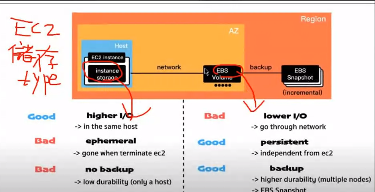

## Elastic Compute Cloud (EC2)

Amazon Elastic Compute Cloud (Amazon EC2) is a web service provided by Amazon Web Services (AWS) that offers resizable compute capacity in the cloud. EC2 allows users to launch and manage virtual servers, known as instances, on-demand. These instances can be used for a wide range of computing tasks, from hosting web applications and websites to running complex data analytics and machine learning workloads.

### Storage

#### Instance Storage

EC2 instances offer fast read and write operations, but it's essential to note that the storage is ephemeral. If the EC2 instance is terminated, all data on it will be lost, as well as the instance itself.

##### Elastic Block Store (EBS)

Elastic Block Store provides internet storage devices with persistent data storage capabilities. Unlike instance storage, data stored on EBS volumes remains intact even if the EC2 instance is terminated. EBS volumes also offer the convenience of snapshot backups.

### Launching an Instance

When launching an EC2 instance, you'll go through several configuration steps:

1. **Naming:** Give your instance a name for easy identification.
2. **Choose AMI (Amazon Machine Image):** Select the image that best suits your requirements.
3. **Choose Instance Type:** Specify the hardware characteristics of your instance. Instances are categorized into families like t1 (memory-oriented), c1 (CPU-oriented), and m1 (memory-oriented), with various sizes, from nano to xlarge, to choose from.
4. **Choose Key Pair:** If you have a key pair, you can set it up for passwordless login to the instance.
5. **Configure Network Settings:** Define your instance's network settings, including security groups.

6. **Configure Storage:** Set up the storage options for your instance

7. **Configure the Number of Instances:** Specify how many instances you want to launch with these configurations.

### Elastic Load Balancer (ELB) 

Elastic Load Balancer (ELB) is used to distribute incoming application traffic across multiple EC2 instances for improved responsiveness and fault tolerance.

#### Auto Scaling Group (ASG)

Auto Scaling Groups allow EC2 instances within an ELB to automatically scale based on predefined criteria. For example, you can set up scaling based on specific metrics. For instance, if the service utilization exceeds 90%, the ASG can automatically scale up the number of EC2 instances to handle the increased load.