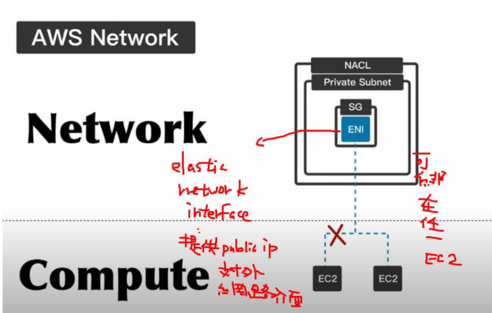

##  Virtual Private Cloud (VPC)

A Virtual Private Cloud (VPC) is a private network within Amazon Web Services (AWS) that allows you to create isolated environments for your resources.

### Internet Gateway (IGW)

An Internet Gateway (IGW) serves as a connection point between your private VPC and the external internet. In the default VPC, subnets are automatically connected to the IGW, simplifying network connectivity.

However, in a custom VPC, you'll need to manually configure connections, including subnets and IGW, to establish connectivity with the external network.

### NAT Gateway (NAT GW)

A NAT Gateway (NAT GW) allows virtual machines within a private cloud to access the internet, typically for tasks like downloading updates or software. It permits outbound traffic from virtual machines inside the private cloud to the external internet but does not allow incoming connections from the internet to the virtual machines within the private cloud.

## Routing

EC2 instances communicate with each other using routing mechanisms within the VPC.

As well as IGW routing to specific ec2 to make it public subnet

### Security

#### Network Access Control Lists (NACLs)

Are a security feature in Amazon Web Services (AWS) that provide an additional layer of security for your Virtual Private Cloud (VPC) subnets. NACLs act as stateless network traffic filters at the subnet level, controlling both inbound and outbound traffic based on specified rules.

NACLs are **non-conditional**, meaning they apply their rules indiscriminately to both inbound and outbound traffic.

#### Security Groups

Security Groups are used to control the inbound and outbound traffic for Amazon Elastic Compute Cloud (EC2) instances or virtual machines. They act as virtual firewalls around your instances, allowing you to define rules for traffic access.

Security Groups operate **conditionally**, meaning they may inspect incoming traffic, but they do not examine outgoing traffic.

#### Elastic Network Interfaces (ENIs)

Elastic Network Interfaces (ENIs) provide external access to resources in your VPC. ENIs can connect to two EC2 instances, enabling redundancy and high availability.

For example, if one EC2 instance provides a MySQL database, and it goes offline, the service may stop. However, if there is another EC2 instance, you can use the second one to maintain the service. To external users, they only need to connect to the ENI, and they don't need to know which EC2 instance is currently providing the service.
